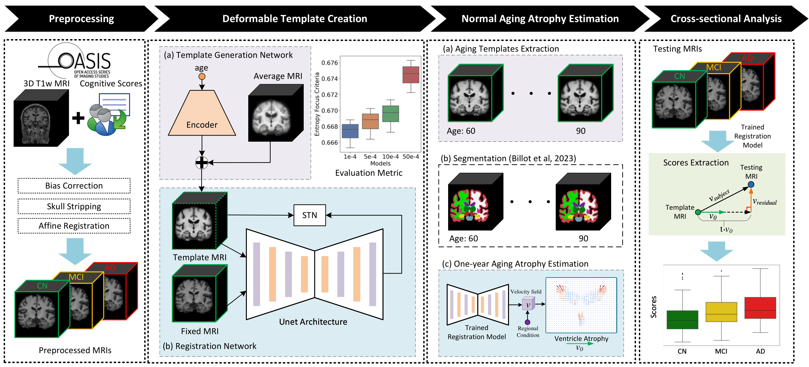

# Deformation-Based Morphometry using Deep Learning



This repository contains the source code for the research paper titled "*A deformation-based morphometry framework for disentangling Alzheimer's disease from normal aging using learned normal aging templates*". You can find the paper [here](xxx). <!-- Insert paper link here -->

## TODOs
- [ ] Add the link to share the OASIS-3 Dataset
- [ ] Add the link to the paper
- [x] Share the pre-trained weights (in `./models`)
- [x] Add the Jupyter notebook demo (`step-by-step_example.ipynb`)

## OASIS-3 Dataset (TBA)
We provide preprocessed OASIS-3 data as part of this study. The data is included in the *npz* format, along with corresponding segmentation masks generated using [SynthSeg](https://github.com/BBillot/SynthSeg) version 2.0.

If you use this dataset, please cite the following and refer to the corresponding [Data Use Agreement](https://www.oasis-brains.org/#access) .
- OASIS-3: Longitudinal Neuroimaging, Clinical, and Cognitive Dataset for Normal Aging and Alzheimer Disease.
Pamela J LaMontagne, Tammie L.S. Benzinger, John C. Morris, Sarah Keefe, Russ Hornbeck, Chengjie Xiong, Elizabeth Grant, Jason Hassenstab, Krista Moulder, Andrei Vlassenko, Marcus E. Raichle, Carlos Cruchaga, Daniel Marcus, 2019. medRxiv. doi: 10.1101/2019.12.13.19014902

## Pre-trained Healthy Template Creation Models
We offer pretrained Atlas-GAN weights trained on the OASIS-3 Dataset for simulating normal aging. Additionally, we provide inference scripts for extracting the learned diffeomorphic registration module and template generation module. (in `./models`)

The extracted healthy templates are also available in NIfTI format, spanning ages from 60 to 90. (in `./example/CN_templates`)

## Citation
```
xxx
```

## Acknowledgements:
This repository is developed based on the [Atlas-GAN](https://github.com/neel-dey/Atlas-GAN) project and makes extensive use of the [VoxelMorph](https://github.com/voxelmorph/voxelmorph) library. 

